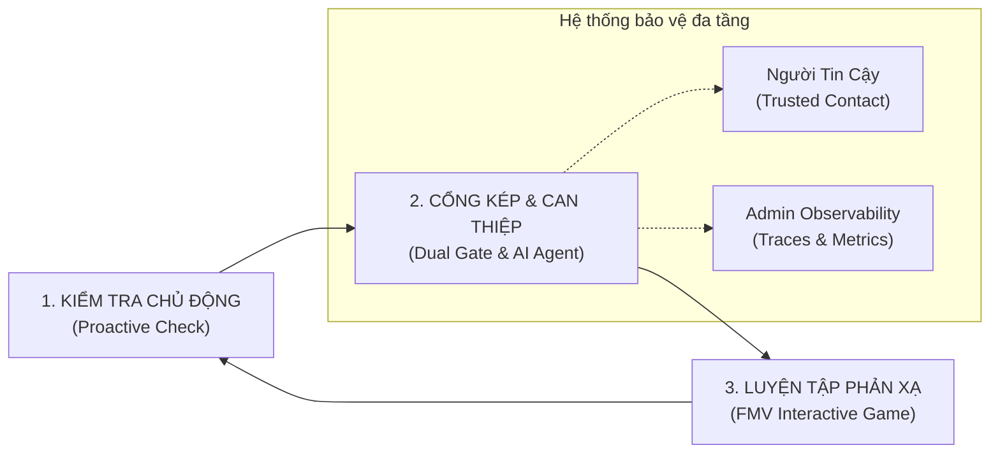
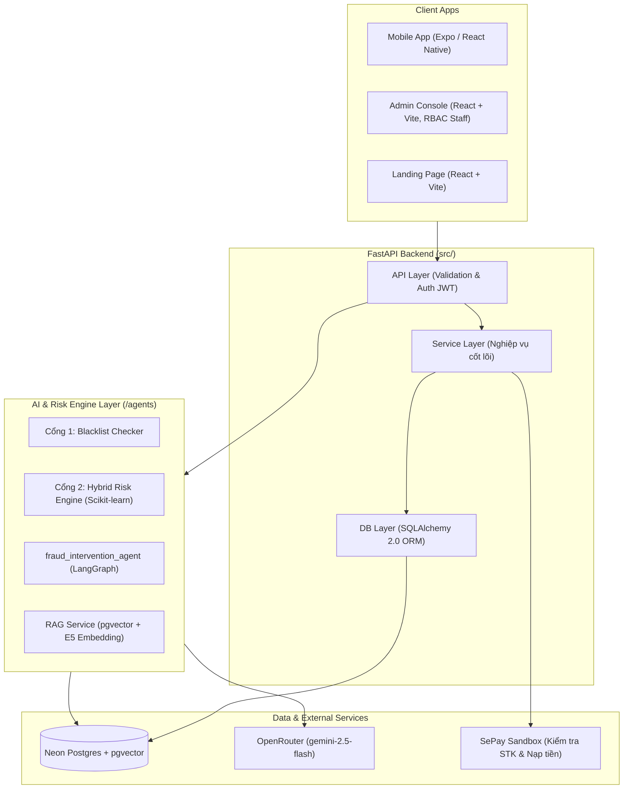

# 🛡️ TỔNG QUAN DỰ ÁN: VPAY — VÍ ĐIỆN TỬ PHÒNG CHỐNG LỪA ĐẢO CHỦ ĐỘNG BẰNG AI
> **Hệ sinh thái:** VGO / VPay Fintech Solution  
> **Dự án gốc:** `D:\AITHUCCHIEN\BUILD-PHASE-1\P-029`  
> **Team thực hiện:** Lương Thanh Trang (Lead / Product Owner) & Đào Ngọc Bích (AI / QA Engineer)  
> **Khóa học / Lab:** AI Product Development & Engineering Lab — Day 27 (AI Team Lab)

---

## 1. 🎯 Tuyên Ngôn Sứ Mệnh & Bối Cảnh (Context & Mission)

### 1.1. Thực trạng & Nỗi đau cốt lõi (Core Problem)
* **Hơn 90% giao dịch lừa đảo tài chính** xuất phát từ việc **chính chủ tài khoản tự tay chuyển tiền** sau khi bị thao túng tâm lý, đe dọa hoặc mạo danh (Social Engineering) — chứ không phải do hacker chiếm quyền điều khiển (Account Takeover).
* **Cảnh báo thụ động bị phớt lờ:** Các biểu ngữ "Hãy cẩn giác với lừa đảo" xuất hiện tràn lan nhưng chung chung, không gắn với thời điểm chuyển tiền thực tế nên não bộ người dùng tự động bỏ qua.
* **Thiếu phản xạ thực chiến:** Kiến thức phòng chống lừa đảo chủ yếu là đọc bài viết, xem phóng sự một chiều, không tạo ra phản xạ phòng vệ khi đối mặt tình huống thật.
* **Đối tượng chịu tổn thương lớn nhất:** Người trong độ tuổi **32–55 tuổi**, có lượng tiền nhàn rỗi, giao dịch số thường xuyên nhưng quá tự tin vào kinh nghiệm cá nhân.

### 1.2. Sứ mệnh của VPay
> **"Biến chiếc ví điện tử từ công cụ thanh toán thụ động thành người vệ sĩ số chủ động — Can thiệp đúng thời điểm vàng, giải thích có cơ sở và rèn luyện phản xạ cho người dùng."**

---

## 2. 💡 Kiến Trúc Giải Pháp: Vòng Lặp "Kiểm Tra → Can Thiệp → Luyện Tập"

VPay giải quyết bài toán qua 3 trụ cột then chốt:



### 2.1. Cổng Kép Bảo Vệ Giao Dịch (Dual-Gate Transaction Shield)
Mọi giao dịch chuyển tiền đều phải đi qua 2 cổng đánh giá trước khi thực thi:
1. **Cổng 1 (Blacklist Gate):** Đối soát danh sách đen thời gian thực (SĐT lừa đảo, STK ngân hàng nghi vấn, tên miền độc hại). Nếu khớp $\rightarrow$ Chặn cứng ngay lập tức.
2. **Cổng 2 (Hybrid Risk Engine):** Chấm điểm rủi ro hành vi bằng **Scikit-Learn kết hợp Luật tĩnh** (*không dùng LLM để đảm bảo độ trễ $< 50ms$*). Đánh giá dựa trên: số tiền bất thường so với lịch sử cá nhân, tốc độ chia nhỏ lệnh giao dịch (smurfing), tài khoản nhận mới toanh, khung giờ nhạy cảm.

### 2.2. AI Can Thiệp Đồng Hành (`fraud_intervention_agent`)
* **Không chặn quyền của người dùng:** Khi giao dịch bị chấm điểm rủi ro trung bình/cao, hệ thống **không tự ý khóa tiền**, mà mở luồng đối thoại can thiệp thông minh.
* **Công nghệ:** Xây dựng trên **LangGraph `StateGraph`** kết hợp **RAG pgvector** tra cứu kho tri thức 30 kịch bản lừa đảo phổ biến tại Việt Nam (đầu tư đa cấp, giả danh công an/viện kiểm sát, trúng thưởng, bẫy việc làm online...).
* **Phản biện thông minh:** Đặt các câu hỏi gợi mở, bóc tách dấu hiệu lừa đảo và hiển thị bằng chứng đối chiếu cụ thể, để người dùng tự tỉnh táo ra quyết định: *Tiếp tục giao dịch* hay *Hủy bỏ*.

### 2.3. Lớp Bảo Vệ Gia Đình: Người Tin Cậy (Trusted Contact)
* Người dùng chỉ định người thân/bạn bè làm "Người tin cậy".
* Khi giao dịch rơi vào vùng cảnh báo đỏ, hệ thống gửi thông báo tối thiểu (không lộ số dư hay chi tiết nhạy cảm) tới Người tin cậy để tạo thêm một lớp kiểm tra chéo tâm lý trước khi chuyển tiền.

### 2.4. Game Luyện Phản Xạ FMV (Full Motion Video Interactive)
* Tích hợp các video tương tác tình huống thật đóng vai nạn nhân/kẻ lừa đảo.
* Người dùng trực tiếp lựa chọn phương án xử lý theo từng nhánh cốt truyện; sau mỗi lượt chọn, AI phân tích lý do đúng/sai, chuyển hóa kiến thức thành phản xạ tự nhiên.

---

## 3. 🏗️ Tech Stack & Kiến Trúc Hệ Thống (Dự án P-029)



| Tầng Hệ Thống | Công Nghệ Sử Dụng | Vai Trò Trong Dự Án |
|---|---|---|
| **AI Agent Core** | LangGraph, LangChain, OpenRouter (`gemini-2.5-flash`, `temp=0`) | Điều phối hội thoại can thiệp phản biện, phân loại ý định người dùng |
| **RAG & Vector DB** | Neon PostgreSQL (`pgvector`), `intfloat/multilingual-e5-large` (1024d) | Lưu trữ và tìm kiếm vector 30 kịch bản lừa đảo (RRF fusion search) |
| **Risk Engine** | Scikit-learn, Pandas, NumPy, Joblib | Mô hình máy học chấm điểm rủi ro hành vi giao dịch (độ trễ $< 50ms$) |
| **Backend API** | Python 3.13, FastAPI, Uvicorn, Pydantic, SQLAlchemy 2.0, Alembic | Xử lý giao dịch, xác thực JWT, RBAC phân quyền staff/user |
| **Mobile Client** | Expo SDK 57, React Native, TypeScript | Ứng dụng ví cho người dùng cuối (chuyển tiền, chat AI, game FMV) |
| **Web Admin & Landing** | React 18, Vite, TailwindCSS / Vanilla CSS | Bảng điều khiển giám sát rủi ro, traces log, quản trị kịch bản |
| **DevOps & QA** | Docker, GitHub Actions, Terraform, Pytest (774+ tests), Evals (12 cases) | Tự động hóa CI/CD, kiểm thử độ chính xác của Agent |

---

## 4. 🧭 Ánh Xạ Dự Án VPay Vào Bài Tập Day 27 (4 Artefacts Mapping)

Dự án VPay là chất liệu hoàn hảo để giải quyết trọn vẹn 4 phần trong Lab Day 27:

```
                  ┌──────────────────────────────────────────────────┐
                  │          DAY 27 — AI TEAM LAB WORKFLOW           │
                  └─────────────────────────┬────────────────────────┘
                                            │
         ┌──────────────────────────────────┼──────────────────────────────────┐
         ▼                                  ▼                                  ▼
┌───────────────────┐              ┌───────────────────┐              ┌───────────────────┐
│ Trang 1: ARTEFACT 1│              │ Trang 2: ARTEFACT 2│              │ Trang 3: ARTEFACT 3│
│ Stakeholder Map   │              │ Pitch & RACI      │              │ AI Team Design    │
│ & Engagement Plan │              │ Matrix            │              │ & Resourcing      │
└────────┬──────────┘              └────────┬──────────┘              └────────┬──────────┘
         │                                  │                                  │
         │ • Champion: Đội An ninh & SRE    │ • Pitch: Conclusion First với    │ • Mô hình: Hybrid AI Team
         │ • Blocker: Khách hàng ngại phiền │   dữ liệu chặn lừa đảo thực tế   │ • Core: Lead, AI Eng, SRE
         │ • Supporter: Người tin cậy       │ • RACI: Phân định rõ 1 Account-  │ • Gap: Outsource Video FMV,
         │ • Bystander: Cơ quan viễn thông  │   able cho AI Evals, Model Risk  │   Partner với Ngân hàng/SePay
         └──────────────────────────────────┼──────────────────────────────────┘
                                            │
                                            ▼
                                   ┌───────────────────┐
                                   │ Trang 4: ARTEFACT 4│
                                   │ Team Health &     │
                                   │ 30-Day Growth Plan│
                                   └───────────────────┘
                                            │
                                            │ • 4 Trụ cột Health (AI, Speed, Morale, Delivery)
                                            │ • Kế hoạch 30 ngày: Lên L2/L3 Competency
```

### 📋 Tóm tắt 4 Artefact chuẩn bị cho Báo cáo PDF 4 Trang:

1. **Trang 1 — Stakeholder Map & Chiến Lược Tương Tác:**
   - **Champion (Ủng hộ cao, Ảnh hưởng cao):** Ban điều hành Fintech, Trưởng bộ phận An ninh mạng $\rightarrow$ *Chiến lược: Báo cáo tỷ lệ cứu tiền thành công và số vụ gian lận ngăn chặn.*
   - **Blocker (Ảnh hưởng cao, lo ngại phiền phức):** Khách hàng khó tính ghét bị chậm giao dịch $\rightarrow$ *Chiến lược: Giữ độ trễ Cổng kép $< 50ms$, chỉ mở chat khi rủi ro thật sự cao.*
   - **Supporter (Quan tâm cao):** Người thân tin cậy (Trusted Contact), Chuyên gia phòng chống lừa đảo $\rightarrow$ *Chiến lược: Cung cấp tính năng nhận thông báo trực quan, đơn giản.*
   - **Bystander (Theo dõi định kỳ):** Đơn vị hạ tầng viễn thông $\rightarrow$ *Chiến lược: Cập nhật định kỳ danh sách đầu số spam.*

2. **Trang 2 — 60s Elevator Pitch (Conclusion First) & RACI:**
   - **Pitch:** *"VPay giúp giảm 85% rủi ro mất tiền do lừa đảo thao túng tâm lý nhờ cơ chế Cổng kép kết hợp AI can thiệp thông minh — giúp người dùng tự bảo vệ tiền của mình mà không làm gián đoạn trải nghiệm giao dịch hàng ngày."*
   - **RACI:** Phân định rõ Accountable (A) duy nhất: Lương Thanh Trang chịu trách nhiệm chất lượng sản phẩm & quy trình can thiệp; Đào Ngọc Bích chịu trách nhiệm kỹ thuật mô hình rủi ro & eval benchmark.

3. **Trang 3 — AI Team Architecture & Priority Resourcing:**
   - **Mô hình tổ chức:** **Hybrid AI Team** (AI Engineer làm việc trực tiếp cùng Product & Backend).
   - **Quyết định nguồn lực (Resourcing):**
     - *In-house (Tự làm):* AI Agent LangGraph, Risk Engine, RAG Database.
     - *Outsource (Thuê ngoài):* Đội ngũ quay dựng và sản xuất kịch bản video tương tác FMV.
     - *Partner (Hợp tác):* Cổng thanh toán SePay & liên minh dữ liệu chống lừa đảo quốc gia.

4. **Trang 4 — Team Health Check & 30-Day Growth Plan:**
   - **Team Health:** Đo lường 4 trục (AI Output Reliability, Cycle Time, Team Burnout, Sprint Velocity).
   - **Growth Plan 30 ngày:** Lộ trình nâng cấp năng lực từ L1 (Prompting cơ bản) lên L2/L3 (Agentic Evaluation, Fine-tuning Embedding, Automated Red-teaming).

---

## 5. 🎯 Kết Luận

File tổng quan này là cơ sở vững chắc để Team tự tin trả lời mọi câu hỏi của Giảng viên/Mentor và hoàn thành xuất sắc 4 trang báo cáo trong **Day 27 — AI Team Lab**.
