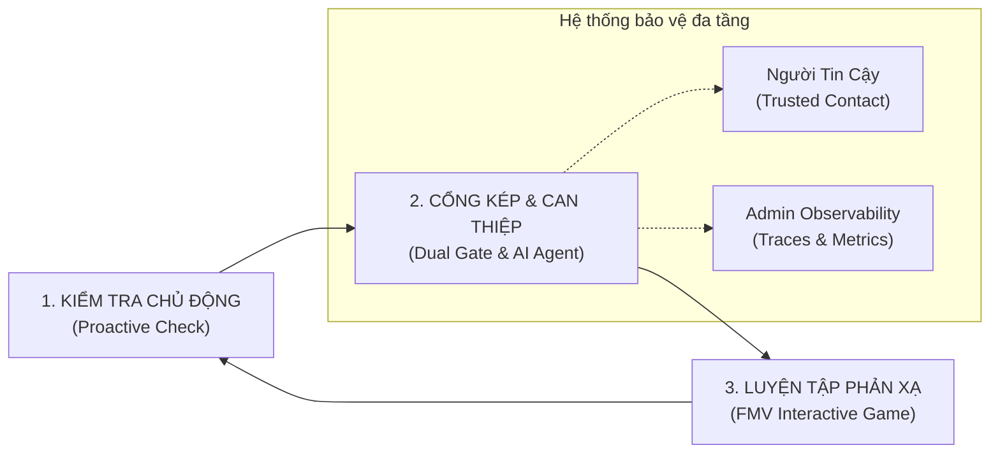
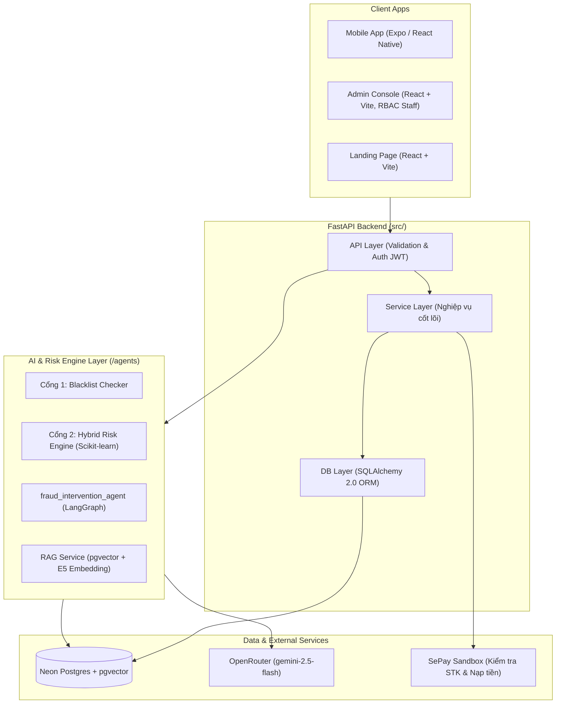

# 🛡️ TỔNG QUAN DỰ ÁN: VPAY — VÍ ĐIỆN TỬ PHÒNG CHỐNG LỪA ĐẢO CHỦ ĐỘNG BẰNG AI
> **Hệ sinh thái:** VGO / VPay Fintech Solution  
> **Dự án gốc:** `D:\AITHUCCHIEN\BUILD-PHASE-1\P-029`  
> **Team thực hiện:** Lương Thanh Trang (Lead / Product Owner) & Đào Ngọc Bích (AI / QA Engineer)  
> **Khóa học / Lab:** AI Product Development & Engineering Lab — Day 27 (AI Team Lab)

---

## 1. 🎯 Tuyên Ngôn Sứ Mệnh & Bối Cảnh (Context & Mission)

### 1.1. Thực trạng & Nỗi đau cốt lõi (Core Problem)
* **Hơn 90% giao dịch lừa đảo tài chính** xuất phát từ việc **chính chủ tài khoản tự tay chuyển tiền** sau khi bị thao túng tâm lý, đe dọa hoặc mạo danh (Social Engineering) — chứ không phải do hacker chiếm quyền điều khiển (Account Takeover).
* **Cảnh báo thụ động bị phớt lờ:** Các biểu ngữ "Hãy cẩn giác với lừa đảo" xuất hiện tràn lan nhưng chung chung, không gắn với thời điểm chuyển tiền thực tế nên não bộ người dùng tự động bỏ qua.
* **Thiếu phản xạ thực chiến:** Kiến thức phòng chống lừa đảo chủ yếu là đọc bài viết, xem phóng sự một chiều, không tạo ra phản xạ phòng vệ khi đối mặt tình huống thật.
* **Đối tượng chịu tổn thương lớn nhất:** Người trong độ tuổi **32–55 tuổi**, có lượng tiền nhàn rỗi, giao dịch số thường xuyên nhưng quá tự tin vào kinh nghiệm cá nhân.

### 1.2. Sứ mệnh của VPay
> **"Biến chiếc ví điện tử từ công cụ thanh toán thụ động thành người vệ sĩ số chủ động — Can thiệp đúng thời điểm vàng, giải thích có cơ sở và rèn luyện phản xạ cho người dùng."**

---

## 2. 💡 Kiến Trúc Giải Pháp: Vòng Lặp "Kiểm Tra → Can Thiệp → Luyện Tập"

VPay giải quyết bài toán qua 3 trụ cột then chốt:

### 2.1. Cổng Kép Bảo Vệ Giao Dịch (Dual-Gate Transaction Shield)
Mọi giao dịch chuyển tiền đều phải đi qua 2 cổng đánh giá trước khi thực thi:
1. **Cổng 1 (Blacklist Gate):** Đối soát danh sách đen thời gian thực (SĐT lừa đảo, STK ngân hàng nghi vấn, tên miền độc hại). Nếu khớp $\rightarrow$ Chặn cứng ngay lập tức.
2. **Cổng 2 (Hybrid Risk Engine):** Chấm điểm rủi ro hành vi bằng **Scikit-Learn kết hợp Luật tĩnh** (*không dùng LLM để đảm bảo độ trễ $< 50ms$*). Đánh giá dựa trên: số tiền bất thường so với lịch sử cá nhân, tốc độ chia nhỏ lệnh giao dịch (smurfing), tài khoản nhận mới toanh, khung giờ nhạy cảm.

### 2.2. AI Can Thiệp Đồng Hành (`fraud_intervention_agent`)
* **Không chặn quyền của người dùng:** Khi giao dịch bị chấm điểm rủi ro trung bình/cao, hệ thống **không tự ý khóa tiền**, mà mở luồng đối thoại can thiệp thông minh.
* **Công nghệ:** Xây dựng trên **LangGraph `StateGraph`** kết hợp **RAG pgvector** tra cứu kho tri thức 30 kịch bản lừa đảo phổ biến tại Việt Nam (đầu tư đa cấp, giả danh công an/viện kiểm sát, trúng thưởng, bẫy việc làm online...).
* **Phản biện thông minh:** Đặt các câu hỏi gợi mở, bóc tách dấu hiệu lừa đảo và hiển thị bằng chứng đối chiếu cụ thể, để người dùng tự tỉnh táo ra quyết định: *Tiếp tục giao dịch* hay *Hủy bỏ*.

### 2.3. Lớp Bảo Vệ Gia Đình: Người Tin Cậy (Trusted Contact)
* Người dùng chỉ định người thân/bạn bè làm "Người tin cậy".
* Khi giao dịch rơi vào vùng cảnh báo đỏ, hệ thống gửi thông báo tối thiểu (không lộ số dư hay chi tiết nhạy cảm) tới Người tin cậy để tạo thêm một lớp kiểm tra chéo tâm lý trước khi chuyển tiền.

### 2.4. Game Luyện Phản Xạ FMV (Full Motion Video Interactive)
* Tích hợp các video tương tác tình huống thật đóng vai nạn nhân/kẻ lừa đảo.
* Người dùng trực tiếp lựa chọn phương án xử lý theo từng nhánh cốt truyện; sau mỗi lượt chọn, AI phân tích lý do đúng/sai, chuyển hóa kiến thức thành phản xạ tự nhiên.

---

## 3. 🏗️ Tech Stack & Kiến Trúc Hệ Thống (Dự án P-029)

| Tầng Hệ Thống | Công Nghệ Sử Dụng | Vai Trò Trong Dự Án |
|---|---|---|
| **AI Agent Core** | LangGraph, LangChain, OpenRouter (`gemini-2.5-flash`, `temp=0`) | Điều phối hội thoại can thiệp phản biện, phân loại ý định người dùng |
| **RAG & Vector DB** | Neon PostgreSQL (`pgvector`), `intfloat/multilingual-e5-large` (1024d) | Lưu trữ và tìm kiếm vector 30 kịch bản lừa đảo (RRF fusion search) |
| **Risk Engine** | Scikit-learn, Pandas, NumPy, Joblib | Mô hình máy học chấm điểm rủi ro hành vi giao dịch (độ trễ $< 50ms$) |
| **Backend API** | Python 3.13, FastAPI, Uvicorn, Pydantic, SQLAlchemy 2.0, Alembic | Xử lý giao dịch, xác thực JWT, RBAC phân quyền staff/user |
| **Mobile Client** | Expo SDK 57, React Native, TypeScript | Ứng dụng ví cho người dùng cuối (chuyển tiền, chat AI, game FMV) |
| **Web Admin & Landing** | React 18, Vite, TailwindCSS / Vanilla CSS | Bảng điều khiển giám sát rủi ro, traces log, quản trị kịch bản |
| **DevOps & QA** | Docker, GitHub Actions, Terraform, Pytest (1560 test thu thập được), 2 bộ eval đã chạy có báo cáo JSON | Tự động hóa CI/CD, kiểm thử độ chính xác của Agent |

---

## 4. 🧭 Bốn Artefact Cuối Cùng (kết quả thật, không phải bản nháp)

> ⚠️ **Mục này đã được viết lại ngày 30/08/2026.** Bản trước là phác thảo sớm và **mâu thuẫn với kết quả cuối**: từng ghi mô hình *Hybrid*, pitch hứa *"giảm 85% rủi ro"*, và stakeholder *Đội SRE / Ban điều hành Fintech / Đơn vị viễn thông* — cả ba đều không còn đúng sau khi team làm đủ 4 phase. Nội dung chuẩn nằm trong 4 file dưới đây; file này chỉ giữ vai trò bối cảnh dự án (mục 1–3).

| Trang | Artefact | File nguồn | Kết luận chốt |
|:---:|:---|:---|:---|
| 1 | Stakeholder Map & 4 chiến lược | [`PHASE_1_STAKEHOLDER_MAP.md`](./PHASE_1_STAKEHOLDER_MAP.md) | 11 stakeholder (Trang 8 + Bích 7, trùng 4). Đủ 4 góc phần tư. Chỉ **3/11 stance có căn cứ thật**, 8 còn lại là giả định kèm hạn kiểm chứng. Ưu tiên: Mentor · chuyên gia anti-phishing · **BP Compliance (chưa ủng hộ)** · nhóm 5 user thử |
| 2 | Pitch Conclusion First & RACI | [`PHASE_2_PITCH_RACI.md`](./PHASE_2_PITCH_RACI.md) | Pitch nhắm BP An ninh & Compliance. Bằng chứng **chỉ dùng số đo thật**: 120 lượt đối kháng 0 rò rỉ · 90 ca recall@3 98.9% · 1560 test. Small ask: 45 phút ngày 04/09. RACI 6 việc, mỗi việc đúng 1 Accountable |
| 3 | AI Team Architecture & Resourcing | [`PHASE_3_AI_TEAM_DESIGN.md`](./PHASE_3_AI_TEAM_DESIGN.md) | Mô hình **EMBEDDED** (không phải Hybrid). 6 Core Role gắn người thật — Bích quá tải 2 vai. 3 gap: tuân thủ PII → **Partner** · sản xuất FMV → **Outsource** · vận hành Evals → **Hire** |
| 4 | Team Health & Growth Plan | [`PHASE_4_TEAM_HEALTH_GROWTH.md`](./PHASE_4_TEAM_HEALTH_GROWTH.md) | Thấp nhất: **Tốc độ ra sản phẩm 2.5/5**. Nút thắt: người viết agent tự chấm agent, eval chạy ngoài CI. Competency: AI Engineer gần L2 → nâng **Evals**. 3 hành động 30 ngày có Owner + Deadline + dấu hiệu |

**Bản nộp gộp:** [`Day27_AI-Team-Lab_TeamXX.pdf`](./Day27_AI-Team-Lab_TeamXX.pdf) — 4 trang A4, mỗi trang một artefact.

---

## 5. 🎯 Kết Luận

Mục 1–3 của file này mô tả bối cảnh và kiến trúc dự án VPay. Toàn bộ kết luận của Lab Day 27 nằm ở 4 file artefact và bản PDF 4 trang liệt kê ở mục 4. Khi có mâu thuẫn giữa file này và 4 file artefact, **lấy 4 file artefact làm chuẩn**.
